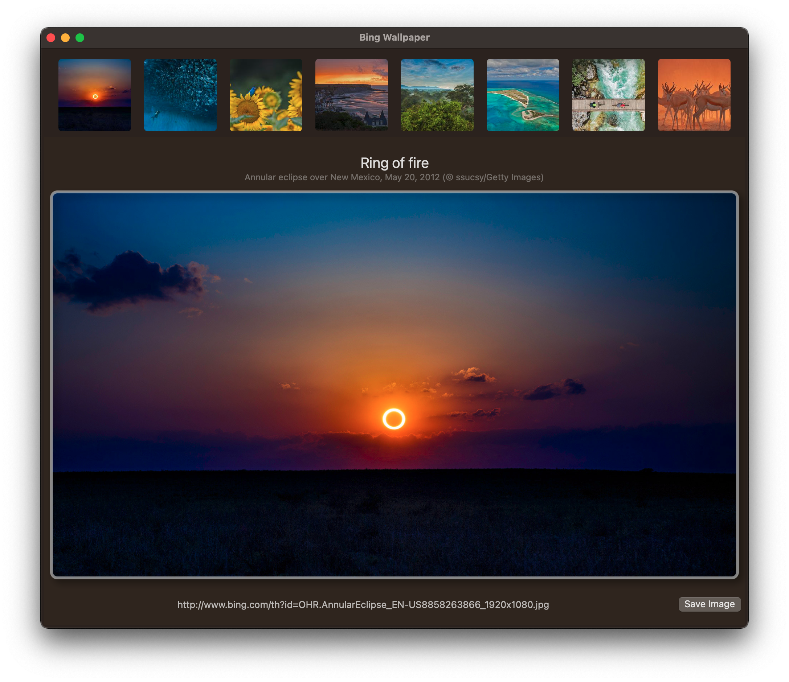

# Bing Wallpaper

MacOS SwiftUI app the shows the current available wallpaper images from Bing.

Setting the image as background is a manual step
- save image to some location
- open ``'System Preferences' | 'Desktop & Screen Saver'`` and select the saved image

API used to retrieve the image meta data  
http://www.bing.com/HPImageArchive.aspx?format=js&idx=0&n=8&mkt=en-US

Post on StackOverflow where the API is described  
https://stackoverflow.com/questions/10639914/is-there-a-way-to-get-bings-photo-of-the-day